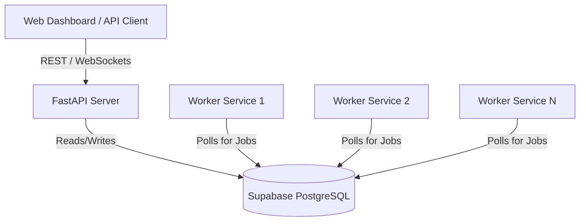
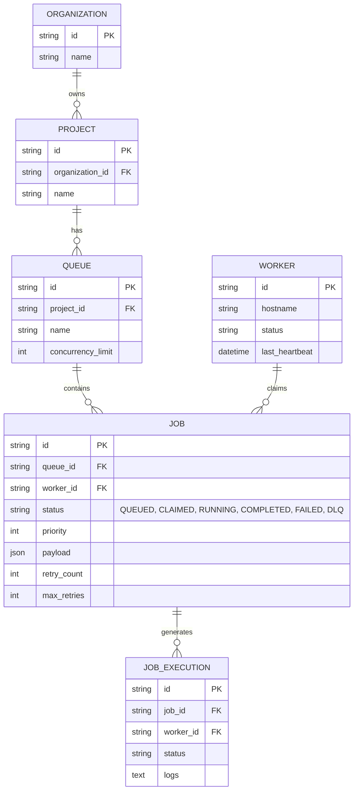

# Distributed Job Scheduler - Design & Architecture

## Architecture Diagram

## Entity Relationship (ER) Diagram

## Design Decisions & Trade-offs

1. **Database-backed Queue vs. Redis/RabbitMQ:**
   - *Decision:* We opted to use PostgreSQL as the queue backend using `FOR UPDATE SKIP LOCKED`.
   - *Trade-off:* While Redis might offer marginally lower latency for pure in-memory queueing, using PostgreSQL simplifies our architecture (no extra infrastructure to manage) while still providing extremely high concurrency guarantees. `SKIP LOCKED` ensures that workers do not block each other while polling for jobs.

2. **Python FastAPI for Backend:**
   - *Decision:* Chosen for its incredible async capabilities and automatic OpenAPI (Swagger) documentation generation.
   - *Trade-off:* Python is sometimes slower than Go or Rust for raw CPU computation, but since most of a job scheduler's time is spent doing I/O (database queries, network requests), FastAPI's async nature is a perfect fit.

3. **Atomic Job Claiming:**
   - *Decision:* Jobs are claimed via a single, atomic SQL UPDATE query with a subquery.
   - *Trade-off:* This prevents race conditions entirely, meaning we do not need distributed locks (like Redlock), reducing system complexity.

4. **Retry Mechanism & DLQ:**
   - *Decision:* Jobs that fail increment a `retry_count`. Once they exceed `max_retries`, their status becomes `DLQ` (Dead Letter Queue).
   - *Trade-off:* We store DLQ jobs in the same table for ease of inspection and requeueing, rather than a separate DLQ table. This makes queries simpler but requires a status index.
