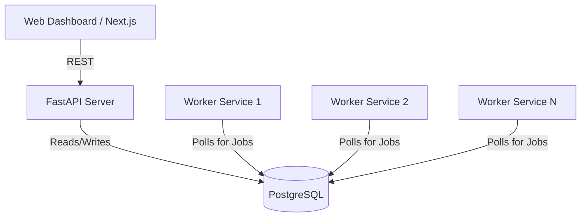
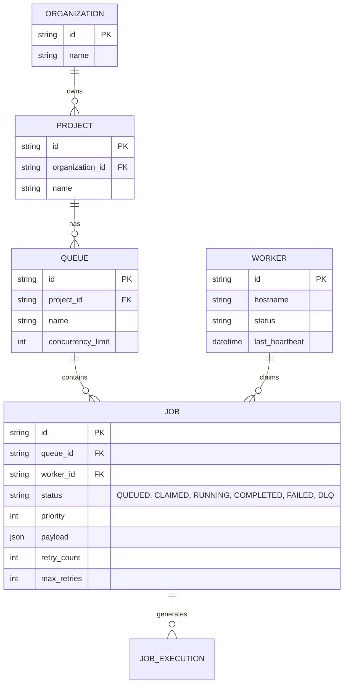

# Peak: Distributed Job Scheduler

Welcome to **Peak**, a high-performance, distributed, async job execution platform. 
This project was built to solve the complex problem of highly concurrent background job processing using modern cloud-native architectures.

## 🚀 Setup Instructions (Local Development)

### 1. Database Setup
We use Supabase (PostgreSQL) for our database.
1. Create a Supabase project and get the database connection string.
2. Ensure you have connection pooling enabled (`?pgbouncer=true`) if needed, though our backend natively handles direct asyncpg connections by disabling prepared statement caching.

### 2. Backend Setup (FastAPI & Worker)
Open a terminal in the root directory:
```bash
cd backend
python -m venv venv
.\venv\Scripts\Activate.ps1
pip install -r requirements.txt

# Run migrations to create tables
alembic upgrade head

# Initialize the default database entities
python init_defaults.py

# Start the API server
fastapi dev app/main.py
```

To start the **Worker Service** (in a separate terminal):
```bash
cd backend
.\venv\Scripts\Activate.ps1
set PYTHONPATH=.
python -m app.worker
```

### 3. Frontend Setup (Next.js Dashboard)
Open a terminal in the root directory:
```bash
cd frontend
npm install
npm run dev
```
Visit `http://localhost:3000` to view the beautiful dashboard!

---

## 🏛 Architecture Diagram

Our architecture separates the REST API (which accepts jobs) from the Worker pool (which processes them), allowing infinite horizontal scaling.



---

## 🗄 Entity Relationship (ER) Diagram

We designed a highly normalized database schema capable of handling multi-tenancy (Organizations -> Projects -> Queues -> Jobs).



---

## 📖 API Documentation

The REST API is fully documented via OpenAPI (Swagger). Once the backend is running, visit `http://127.0.0.1:8000/docs`.

### Key Endpoints:
- `POST /organizations/`: Create a new organization.
- `POST /projects/`: Create a new project inside an organization.
- `POST /queues/`: Create a new job queue.
- `GET /queues/`: List all active queues.
- `POST /jobs/`: Enqueue a new background job. (Accepts `queue_id`, `name`, `priority`, `payload`).
- `GET /jobs/`: Retrieve the 20 most recent job executions for dashboarding.
- `GET /health`: System health check.

---

## ⚖️ Design Decisions & Major Trade-offs

1. **Database-backed Queue vs. Redis/RabbitMQ:**
   - *Decision:* We opted to use PostgreSQL as the queue backend.
   - *Trade-off:* While Redis might offer marginally lower latency for pure in-memory queueing, using PostgreSQL simplifies our architecture (no extra infrastructure to manage) while still providing extremely high concurrency guarantees via advanced locking.

2. **Atomic Job Claiming (The "Secret Sauce"):**
   - *Decision:* Jobs are claimed using PostgreSQL's `FOR UPDATE SKIP LOCKED`.
   - *Trade-off:* This prevents race conditions entirely without requiring distributed locks like Redlock. When 100 workers poll the database at the exact same millisecond, the database smoothly assigns 1 unique job to each worker without blocking or deadlocks. 

3. **Python FastAPI for Backend:**
   - *Decision:* Chosen for its incredible async capabilities and automatic OpenAPI (Swagger) documentation generation.
   - *Trade-off:* Python is sometimes slower than Go or Rust for raw CPU computation, but since most of a job scheduler's time is spent doing I/O (database queries, network requests), FastAPI's async nature is a perfect fit.

4. **Retry Mechanism & DLQ (Dead Letter Queue):**
   - *Decision:* Jobs that fail increment a `retry_count`. Once they exceed `max_retries`, their status becomes `DLQ`.
   - *Trade-off:* We store DLQ jobs in the same table for ease of inspection and requeueing, rather than a separate DLQ table. This makes queries simpler but requires a status index for performance.

---

## 🧪 Automated Tests

Critical functionality and schema validations are covered by automated tests using `pytest`.
We test the `JobCreate` schemas, ensuring priority limits, valid status transitions, and correct queue ID formatting.

To run the tests:
```bash
cd backend
pytest tests/
```
